Metacells Vignette
==================

This vignette demonstrates step-by-step use of the metacells package to
analyze scRNA-seq data. The latest version of this vignette is available
in
`Github <https://github.com/tanaylab/metacells/blob/master/sphinx/Manual_Analysis.rst>`__.

Preparation
-----------

First, let’s import the Python packages we’ll be using. If you don’t
have these installed, run ``pip install metacells``, and also
``pip install seaborn`` for the embedded diagrams - this is just for the
purpose of this vignette; the metacells package itself has no dependency
on any visualization packages.

.. code:: python

    import anndata as ad
    import matplotlib.pyplot as plt
    import metacells as mc
    import numpy as np
    import os
    import pandas as pd
    import scipy.sparse as sp
    import seaborn as sb

    from math import hypot
    from matplotlib.collections import LineCollection
    from IPython.display import set_matplotlib_formats

    set_matplotlib_formats('svg')
    sb.set_style("white")

.. code::

    /home/obk/anaconda3/envs/py3.7/lib/python3.7/site-packages/ipykernel_launcher.py:14: DeprecationWarning: `set_matplotlib_formats` is deprecated since IPython 7.23, directly use `matplotlib_inline.backend_inline.set_matplotlib_formats()`

Getting the raw data
--------------------

The metacells package is built around the
`scanpy <https://pypi.org/project/scanpy/>`__ framework. In particular
it uses `anndata <https://pypi.org/project/anndata/>`__ to hold the
analyzed data, and uses ``.h5ad`` files to persist this data on disk.
You can access also these files directly from R using several packages,
most notably
`anndata <https://cran.r-project.org/web/packages/anndata/index.html>`__.

You can convert data from various “standard” scRNA data formats into a
``.h5ad`` file using any of the functions available in the scanpy and/or
anndata packages. Note that converting textual data to this format takes
a “non-trivial” amount of time for large data sets. Mercifully, this is
a one-time operation. Less excusable is the fact that none of the above
packages memory-map the ``.h5ad`` files so reading large files will
still take a noticeable amount of time for no good reason.

For the purposes of this vignette, we’ll use a 160K cells data set which
is a unification of several batches of PBMC scRNA data from
`10x <https://support.10xgenomics.com/single-cell-gene-expression/datasets%3E>`__,
specifically from the “Single Cell 3’ Paper: Zheng et al. 2017”
datasets. Since 10x do not provide stable links to their data sets, and
to avoid the long time it would take to convert their textual format
files to ``.h5ad`` files, simply download the compressed data file
`pbmc163k.h5ad.gz <http://www.wisdom.weizmann.ac.il/~atanay/metac_data/pbmc163k.h5ad.gz>`__
to your work directory (using ``wget``, ``curl``, your browser’s
download function, etc.), and then run ``gunzip pbmc163k.h5ad.gz`` (or
your zip program of choice) to extract the ``pbmc163k.h5ad`` file which
we read below.

The metacells package uses a convention where the ``__name__``
unstructured property of the data contains its name for logging
purposes; we initialize this name to ``PBMC`` below.

.. code:: python

    raw = ad.read_h5ad('pbmc163k.h5ad')
    mc.ut.set_name(raw, 'PBMC')
    print(raw.shape)

.. code::

    (163234, 32738)

Cleaning the data
-----------------

The first step in processing the data is to extract a “clean” subset of
it for further analysis.

If the data set contains metadata that can be used to rule out some of
the genes or cells, this is a good time to do it, using the
``mc.ut.slice`` function.

Regardless of such metadata, we still need to perform initial filtering
of the data. The exact details might vary depending on your specific
data set’s origins. Still, the metacells package supports a basic
2-phase procedure which should be useful in many cases.

Cleaning the genes
~~~~~~~~~~~~~~~~~~

The first phase excludes genes from the “clean” data.

Excluding genes by name
^^^^^^^^^^^^^^^^^^^^^^^

Some genes are known to be detrimental for the analysis and should be
excluded from the clean data based on their name. The poster child for
such genes are mitochondrial genes which we exclude using a pattern (all
genes whose name starts with ``MT-``).

.. code:: python

    excluded_gene_names = ['IGHMBP2', 'IGLL1', 'IGLL5', 'IGLON5', 'NEAT1', 'TMSB10', 'TMSB4X']
    excluded_gene_patterns = ['MT-.*']

Excluding genes by their expression
^^^^^^^^^^^^^^^^^^^^^^^^^^^^^^^^^^^

We also want to exclude genes based on their expression. For example, it
makes no sense to keep genes which have zero expression in our data set
- in general we allow specifying a threshold on the minimal total UMIs
of the gene in the data set. In addition, we have discovered it is
useful to exclude “noisy lonely genes”, that is, genes which have a
significant expression level but no significant correlation with any
other gene.

Automating clean genes selection
^^^^^^^^^^^^^^^^^^^^^^^^^^^^^^^^

We provide a function that automates the above (given an explicit list
of excluded gene names). All it does is create per-gene (variable)
annotations in the data: ``excluded_gene``, ``properly_sampled_gene``,
and ``noisy_lonely_gene``. You can achieve the same effect by manually
invoking the lower-level functions (e.g.,
``mc.tl.find_noisy_lonely_genes``). Or, you could create additional
masks of your own based on your own criteria.

.. code:: python

    mc.pl.analyze_clean_genes(raw,
                              excluded_gene_names=excluded_gene_names,
                              excluded_gene_patterns=excluded_gene_patterns,
                              random_seed=123456)

.. code::

    set PBMC.var[properly_sampled_gene]: 22637 true (69.15%) out of 32738 bools
    set PBMC.var[excluded_gene]: 20 true (0.06109%) out of 32738 bools
    set PBMC.var[noisy_lonely_gene]: 0 true (0%) out of 32738 bools

We then combine all these mask into a final ``clean_gene`` mask. By
default this is based on the three masks listed above, but you can
customize it to use any list of per-gene masks instead.

.. code:: python

    mc.pl.pick_clean_genes(raw)

.. code::

    set PBMC.var[clean_gene]: 22617 true (69.08%) out of 32738 bools

This is a good time to save the data so we can load it later without
recomputing it. We’ll do this under a different name to avoid modifying
the raw file, and we’ll rename our variable refering to it for clarity.

.. code:: python

    raw.write('full.h5ad')
    full = raw

Cleaning the cells
~~~~~~~~~~~~~~~~~~

The second phase is excluding cells. We do so based on two criteria: the
total number of UMIs we have for each cell, and the fraction of these
UMIs that come from excluded (non-clean) genes.

Setting these thresholds is done manually. To guide this decision, we
can visualize the relevant distributions.

Thresholds on the total number of UMIs
^^^^^^^^^^^^^^^^^^^^^^^^^^^^^^^^^^^^^^

We’ll start with looking at the total UMIs per cell. We set a threshold
for the minimal and maximal number of UMIs of cells we wish to analyze.

.. code:: python

    properly_sampled_min_cell_total = 800
    properly_sampled_max_cell_total = 8000

    total_umis_of_cells = mc.ut.get_o_numpy(full, name='__x__', sum=True)

    plot = sb.distplot(total_umis_of_cells)
    plot.set(xlabel='UMIs', ylabel='Density', yticks=[])
    plot.axvline(x=properly_sampled_min_cell_total, color='darkgreen')
    plot.axvline(x=properly_sampled_max_cell_total, color='crimson')

    too_small_cells_count = sum(total_umis_of_cells < properly_sampled_min_cell_total)
    too_large_cells_count = sum(total_umis_of_cells > properly_sampled_max_cell_total)

    too_small_cells_percent = 100.0 * too_small_cells_count / len(total_umis_of_cells)
    too_large_cells_percent = 100.0 * too_large_cells_count / len(total_umis_of_cells)

    print(f"Will exclude %s (%.2f%%) cells with less than %s UMIs"
          % (too_small_cells_count,
             too_small_cells_percent,
             properly_sampled_min_cell_total))
    print(f"Will exclude %s (%.2f%%) cells with more than %s UMIs"
          % (too_large_cells_count,
             too_large_cells_percent,
             properly_sampled_max_cell_total))

.. code::

    /home/obk/anaconda3/envs/py3.7/lib/python3.7/site-packages/seaborn/distributions.py:2619: FutureWarning: `distplot` is a deprecated function and will be removed in a future version. Please adapt your code to use either `displot` (a figure-level function with similar flexibility) or `histplot` (an axes-level function for histograms).
      warnings.warn(msg, FutureWarning)

.. code::

    Will exclude 12983 (7.95%) cells with less than 800 UMIs
    Will exclude 349 (0.21%) cells with more than 8000 UMIs

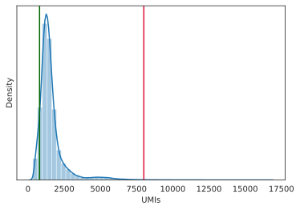

Thresholds on the fractionof excluded gene UMIs
^^^^^^^^^^^^^^^^^^^^^^^^^^^^^^^^^^^^^^^^^^^^^^^

We also set a threshold on the fraction of excluded gene UMIs in each
cell we wish to analyze. This ensures that there will be a sufficient
number of clean gene UMIs left to analyze.

.. code:: python

    properly_sampled_max_excluded_genes_fraction = 0.1

    excluded_genes_data = mc.tl.filter_data(full, var_masks=['~clean_gene'])[0]
    excluded_umis_of_cells = mc.ut.get_o_numpy(excluded_genes_data, name='__x__', sum=True)
    excluded_fraction_of_umis_of_cells = excluded_umis_of_cells / total_umis_of_cells

    plot = sb.distplot(excluded_fraction_of_umis_of_cells)
    plot.set(xlabel='Fraction of excluded gene UMIs', ylabel='Density', yticks=[])
    plot.axvline(x=properly_sampled_max_excluded_genes_fraction, color='crimson')

    too_excluded_cells_count = sum(excluded_fraction_of_umis_of_cells > properly_sampled_max_excluded_genes_fraction)

    too_excluded_cells_percent = 100.0 * too_excluded_cells_count / len(total_umis_of_cells)

    print(f"Will exclude %s (%.2f%%) cells with more than %.2f%% excluded gene UMIs"
          % (too_excluded_cells_count,
             too_excluded_cells_percent,
             100.0 * properly_sampled_max_excluded_genes_fraction))

.. code::

    /home/obk/anaconda3/envs/py3.7/lib/python3.7/site-packages/seaborn/distributions.py:2619: FutureWarning: `distplot` is a deprecated function and will be removed in a future version. Please adapt your code to use either `displot` (a figure-level function with similar flexibility) or `histplot` (an axes-level function for histograms).
      warnings.warn(msg, FutureWarning)

.. code::

    Will exclude 256 (0.16%) cells with more than 10.00% excluded gene UMIs

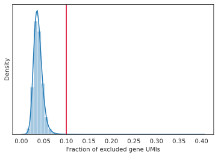

Automating clean cells selection
^^^^^^^^^^^^^^^^^^^^^^^^^^^^^^^^

We provide a function that automates the above (given the thresholds).
All it does is create per-cell (observation) annotation in the data:
``properly_sampled_cell``. You can achieve the same effect by manually
invoking the lower-level functions (e.g.,
``mc.tl.find_properly_sampled_cells``). Or, you could create additional
masks of your own based on your own criteria.

.. code:: python

    mc.pl.analyze_clean_cells(
        full,
        properly_sampled_min_cell_total=properly_sampled_min_cell_total,
        properly_sampled_max_cell_total=properly_sampled_max_cell_total,
        properly_sampled_max_excluded_genes_fraction=properly_sampled_max_excluded_genes_fraction)

.. code::

    set PBMC.obs[properly_sampled_cell]: 149825 true (91.79%) out of 163234 bools

We again combine all the relevant masks into a final ``clean_cell``
mask. By default this is based just on the ``properly_sampled_cell``
mask, but you can customize it to use any list of per-cell masks
instead.

.. code:: python

    mc.pl.pick_clean_cells(full)

.. code::

    set PBMC.obs[clean_cell]: 149825 true (91.79%) out of 163234 bools

Extracting the clean data
~~~~~~~~~~~~~~~~~~~~~~~~~

We now extract just the clean genes and cells data out of the data set,
using the ``clean_gene`` and ``clean_cell`` masks, to obtain the clean
data we’ll be analyzing.

.. code:: python

    clean = mc.pl.extract_clean_data(full)

.. code::

    set PBMC.clean.obs[full_cell_index]: 149825 int64s
    set PBMC.clean.var[full_gene_index]: 22617 int64s

Initial forbidden genes
~~~~~~~~~~~~~~~~~~~~~~~

Some of the genes that are included in the clean data are “lateral”,
that is, indicate some real biolgical behavior such as cell cycle, but
are irrelevant to the biological questions we are interested in. Such
genes shouldn’t be completely excluded - for example they are used to
detect outliers. That is, we will still make sure the level of the
expression of these genes is consistent for all the cells (e.g., the
cells will be of the same cell cycle stage), but we do not want the
algorithm to create metacells based on these genes (e.g., creating a
metacell with a strong consistent S-state signature, but mixing up
weakly different cell behaviors which we are trying to isolate).

To ensure this, we can specify (again by name or by pattern) “forbidden
genes”, that is, genes which must not be used as “feature genes”. Coming
up with the list of forbidden genes for a new data set is not trivial,
and in general may require an iterative approach, where we generate
metacells, understand their behavior, identify additional lateral gene
modules we’d like to add to the list, and then recompute the metacells.

To kickstart this process, we can start with a few “known suspect”
genes, and (manually) consider genes which are related (correlated) to
them. We correlate all the (interesting) genes with each other (using a
random subset of the cells for efficiency), cluster the genes using
these correlations, split the genes into modules with some maximal
number of genes in each, and finally look at each cluster containing any
of the suspect genes to decide which genes to add to the list.

.. code:: python

    suspect_gene_names = ['PCNA', 'MKI67', 'TOP2A', 'HIST1H1D',
                          'FOS', 'JUN', 'HSP90AB1', 'HSPA1A',
                          'ISG15', 'WARS' ]
    suspect_gene_patterns = [ 'MCM[0-9]', 'SMC[0-9]', 'IFI.*' ]
    suspect_genes_mask = mc.tl.find_named_genes(clean, names=suspect_gene_names,
                                                patterns=suspect_gene_patterns)
    suspect_gene_names = sorted(clean.var_names[suspect_genes_mask])

This gave us a list of 49 suspect genes. To look for additional
candidates, let us first look for the (coarse) relationship between
“interesting” genes. This isn’t meant to be detailed, we are looking for
lateral genes which are strongly correlated with our suspects, so the
code samples a subset of the cells and ignores genes which are too weak
to matter.

.. code:: python

    mc.pl.relate_genes(clean, random_seed=123456)

.. code::

    set PBMC.clean.var[related_genes_module]: 21549 outliers (95.28%) out of 22617 int32 elements with 73 groups with mean size 14.63
    set PBMC.clean.varp[related_genes_similarity]: csr_matrix 22617 X 22617 float32s (1140624 > 0)

This discovered 73 gene modules with ~15 genes in each one. In general,
it may prove beneficial to look at each and every one of them. This
would give us some idea about (most of) the gene modules that
characterize the cell types in the data, and for our purpose now, may
suggest additional lateral gene modules unrelated to our original
suspect genes. However, to keep this vignette simple, let us just look
at the modules containing already suspect genes:

.. code:: python

    module_of_genes = clean.var['related_genes_module']
    suspect_gene_modules = np.unique(module_of_genes[suspect_genes_mask])
    suspect_gene_modules = suspect_gene_modules[suspect_gene_modules >= 0]
    print(suspect_gene_modules)

.. code::

    [ 4  5 14 19 21 35 42 47 52 54 65 68]

For each such module, let us look at the genes it contains and the
similarity between them:

.. code:: python

    similarity_of_genes = mc.ut.get_vv_frame(clean, 'related_genes_similarity')
    for gene_module in suspect_gene_modules:
        module_genes_mask = module_of_genes == gene_module
        similarity_of_module = similarity_of_genes.loc[module_genes_mask, module_genes_mask]
        similarity_of_module.index = \
        similarity_of_module.columns = [
            '(*) ' + name if name in suspect_gene_names else name
            for name in similarity_of_module.index
        ]
        ax = plt.axes()
        sb.heatmap(similarity_of_module, vmin=0, vmax=1, xticklabels=True, yticklabels=True, ax=ax, cmap="YlGnBu")
        ax.set_title(f'Gene Module {gene_module}')
        plt.show()

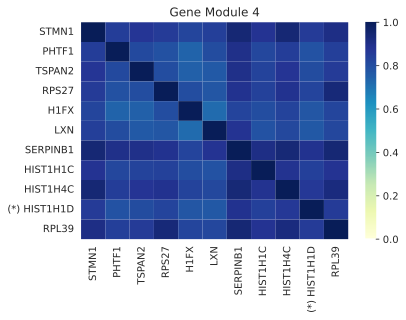

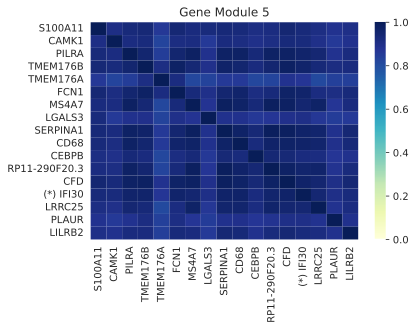

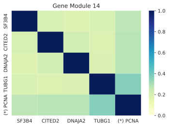

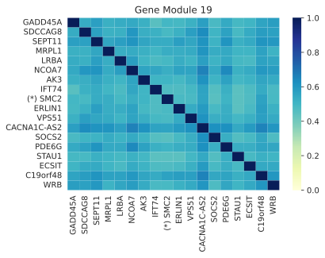

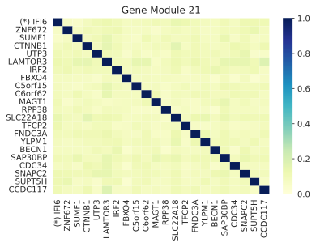

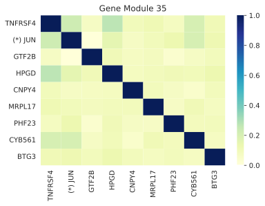

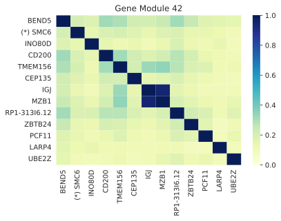

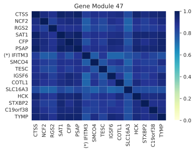

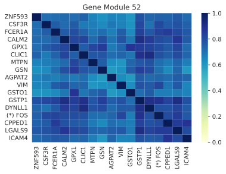

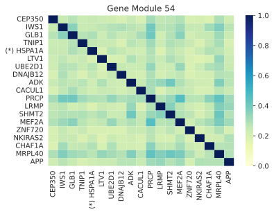

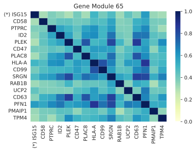

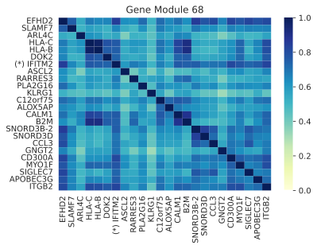

We can now extend the list of forbidden genes to include additional
genes using these modules. Note we’d rather err on the side of caution
and not forbid genes needlessly, since we expect the metacell analysis
to help us expose any remaining genes we have missed. That said, thiw
will require us to regenerate the metacells with the expanded forbidden
genes list.

For simplicity, we’ll simply forbid all the original suspect genes as
well as all the genes in the strong modules 4, 5, 47, 52 and 68. This
gives us a total of 106 initially forbidden genes:

.. code:: python

    forbidden_genes_mask = suspect_genes_mask
    for gene_module in [4, 5, 47, 52]:
        module_genes_mask = module_of_genes == gene_module
        forbidden_genes_mask |= module_genes_mask
    forbidden_gene_names = sorted(clean.var_names[forbidden_genes_mask])
    print(len(forbidden_gene_names))
    print(' '.join(forbidden_gene_names))

.. code::

    106
    AGPAT2 C19orf38 CALM2 CAMK1 CD68 CEBPB CFD CFP CLIC1 COTL1 CPPED1 CSF3R CTSS DYNLL1 FCER1A FCN1 FOS GPX1 GSN GSTO1 GSTP1 H1FX HCK HIST1H1C HIST1H1D HIST1H4C HSP90AB1 HSPA1A ICAM4 IFI16 IFI27 IFI27L1 IFI27L2 IFI30 IFI35 IFI44 IFI44L IFI6 IFIH1 IFIT1 IFIT1B IFIT2 IFIT3 IFIT5 IFITM1 IFITM10 IFITM2 IFITM3 IFITM5 IGSF6 ISG15 JUN LGALS3 LGALS9 LILRB2 LRRC25 LXN MCM10 MCM2 MCM3 MCM3AP MCM3AP-AS1 MCM4 MCM5 MCM6 MCM7 MCM8 MCM9 MKI67 MS4A7 MTPN NCF2 PCNA PHTF1 PILRA PLAUR PSAP RGS2 RP11-290F20.3 RPL39 RPS27 S100A11 SAT1 SERPINA1 SERPINB1 SLC16A3 SMC1A SMC1B SMC2 SMC3 SMC4 SMC5 SMC5-AS1 SMC6 SMCO4 STMN1 STXBP2 TESC TMEM176A TMEM176B TOP2A TSPAN2 TYMP VIM WARS ZNF593

Computing the metacells
-----------------------

Once we have a clean data set for analysis, we can go ahead and compute
the metacells.

Main parameters
~~~~~~~~~~~~~~~

There are many parameters other than the forbidden genes list that we
can tweak (see ``mc.pl.divide_and_conquer_pipeline``). Here we’ll just
discuss controlling the main ones.

Reproducibility
^^^^^^^^^^^^^^^

The ``random_seed`` must be non-zero to ensure reprodibility. Note that
even though the implementation is parallel for efficiency, the results
are still reprodicible given the same random seed (in contrast to the
``umap`` package where you need to specify an additional flag for
reproducible results).

Target Metacell size
^^^^^^^^^^^^^^^^^^^^

The ``target_metacell_size`` (number of UMIs). We want each metacell to
have a sufficient number of UMIs so that we get a robust estimation of
the expression of each (relevant) gene in it. By default the target is
160,000 UMIs. The algorithm will generate metacells no larger than
double this size (that is, a maximum of 320,000 UMIs per metacell) and
no fewer than a quarter of this size (that is, a minimum of 40,000 UMIs
per metacell), where metacells smaller than half the size (that is,
between 40,000 UMIs and 80,000 UMIs) are “especially distinct”. These
ratios and relevant thresholds can all be controlled using additional
parameters. #### Parallelism

By default, the implementation uses all the physical cores of the system
(ignoring hyper-threading as using them actually reduces performance).
It is possible to reduce the number of cores used by invoking
``mc.ut.set_processors_count`` (or set the
``METACELLS_PROCESSORS_COUNT`` environment variable), if one wants to
avoid taking all the physical cores for some reason. More importantly,
one may want to use ``mc.pl.set_max_parallel_piles`` (or set the
``METACELLS_MAX_PARALLEL_PILES`` environment variable) to reduce the
number of piles processed in parallel (values higher than the maximal
number of processes have no effect).

Processing each pile takes a significant amount of memory (several GBs,
depending on how dense the cells UMIs matrix is). On a server with a
high core count and a limited amount of memory, this can cause the
computation to crash with an error message complaining about failed
allocations or some other indication of running out of memory,
especially if other memory-intensive programs are running at the same
time. Note that the implementation also needs to load the full data set
into memory, which takes a large amount of memory regardless of
computing the piles, and again varies depending on how dense the cells
UMIs matrix is.

The ``mc.pl.guess_max_parallel_piles`` function can be invoked after
loading the input cells data and before computing the metacells, and
will return a hopefully reasonable guess for the maximal number of
parallel piles to use, based on the density of the input, the amount of
RAM available, and the target pile size. That said, this is just a
(conservative) guess. When running very large data sets (millions of
cells), it is best to avoid any other heavy computations on the same
server, keep an eye on the memory usage, and tweak the parameters if
needed.

The expected run-time of the computation will depend on the size of the
data, the density of the UMIs map, and the amount of parallelism used.
It can take well over an hour to fully analyze a dataset of millions of
cells on a large server (with dozens of physical processors), and this
will consume hundreds of gigabytes of memory. Luckily, smaller data sets
(like the ~160K PBMC dataset we use here) only take a few minutes to
compute on such a strong server, using only a few tens of gigabytes.
This makes it possible to analyze such data sets on a strong modern
laptop with 16GB (or better yet, 32GB) of RAM.

.. code:: python

    max_parallel_piles = mc.pl.guess_max_parallel_piles(clean)
    print(max_parallel_piles)
    mc.pl.set_max_parallel_piles(max_parallel_piles)

.. code::

    555

Grouping into Metacells
~~~~~~~~~~~~~~~~~~~~~~~

We can finally compute the metacells. We are only running this on ~160K
cells, still this may take a few minutes, depending on the number of
cores on your server. For ~2 million cells this takes ~10 minutes on a
28-core server.

.. code:: python

    mc.pl.divide_and_conquer_pipeline(clean,
                                      forbidden_gene_names=forbidden_gene_names,
                                      #target_metacell_size=...,
                                      random_seed=123456)

.. code::

    set PBMC.clean.var[rare_gene_module_0]: 4 true (0.01769%) out of 22617 bools
    set PBMC.clean.var[rare_gene_module_1]: 29 true (0.1282%) out of 22617 bools
    set PBMC.clean.var[rare_gene]: 33 true (0.1459%) out of 22617 bools
    set PBMC.clean.obs[cells_rare_gene_module]: 149102 outliers (99.52%) out of 149825 int32 elements with 2 groups with mean size 361.5
    set PBMC.clean.obs[rare_cell]: 723 true (0.4826%) out of 149825 bools
    set PBMC.clean.uns[pre_directs]: 16
    set PBMC.clean.uns[directs]: 23
    set PBMC.clean.var[pre_high_total_gene]: 8307 positive (36.73%) out of 22617 int32s
    set PBMC.clean.var[high_total_gene]: 10507 positive (46.46%) out of 22617 int32s
    set PBMC.clean.var[pre_high_relative_variance_gene]: 11636 positive (51.45%) out of 22617 int32s
    set PBMC.clean.var[high_relative_variance_gene]: 13244 positive (58.56%) out of 22617 int32s
    set PBMC.clean.var[forbidden_gene]: 106 true (0.4687%) out of 22617 bools
    set PBMC.clean.var[pre_feature_gene]: 440 positive (1.945%) out of 22617 int32s
    set PBMC.clean.var[feature_gene]: 702 positive (3.104%) out of 22617 int32s
    set PBMC.clean.var[pre_gene_deviant_votes]: 2394 positive (10.58%) out of 22617 int32s
    set PBMC.clean.var[gene_deviant_votes]: 2341 positive (10.35%) out of 22617 int32s
    set PBMC.clean.obs[pre_cell_directs]: 149825 int32s with mean 1.039
    set PBMC.clean.obs[cell_directs]: 149825 int32s with mean 1.033
    set PBMC.clean.obs[pre_pile]: 0 outliers (0%) out of 149825 int32 elements with 18 groups with mean size 8324
    set PBMC.clean.obs[pile]: 0 outliers (0%) out of 149825 int32 elements with 23 groups with mean size 6514
    set PBMC.clean.obs[pre_candidate]: 0 outliers (0%) out of 149825 int32 elements with 1631 groups with mean size 91.86
    set PBMC.clean.obs[candidate]: 0 outliers (0%) out of 149825 int32 elements with 1587 groups with mean size 94.41
    set PBMC.clean.obs[pre_cell_deviant_votes]: 0 positive (0%) out of 149825 int32s
    set PBMC.clean.obs[cell_deviant_votes]: 765 positive (0.5106%) out of 149825 int32s
    set PBMC.clean.obs[pre_dissolved]: 0 true (0%) out of 149825 bools
    set PBMC.clean.obs[dissolved]: 177 true (0.1181%) out of 149825 bools
    set PBMC.clean.obs[pre_metacell]: 0 outliers (0%) out of 149825 int32 elements with 1600 groups with mean size 93.64
    set PBMC.clean.obs[metacell]: 942 outliers (0.6287%) out of 149825 int32 elements with 1549 groups with mean size 96.12
    set PBMC.clean.obs[outlier]: 942 true (0.6287%) out of 149825 bools

This has written many annotations for each cell (observation), the most
important of which is ``metacell`` specifying the 0-based index of the
metacell each cell belongs to (or -1 if the cell is an “outlier”).

However, for further analysis, what we want is data where each
observation is a metacell:

.. code:: python

    metacells = mc.pl.collect_metacells(clean, name='PBMC.metacells')

.. code::

    set PBMC.metacells.var[excluded_gene]: 0 true (0%) out of 22617 bools
    set PBMC.metacells.var[clean_gene]: 22617 true (100%) out of 22617 bools
    set PBMC.metacells.var[forbidden_gene]: 106 true (0.4687%) out of 22617 bools
    set PBMC.metacells.var[pre_feature_gene]: 440 positive (1.945%) out of 22617 int32s
    set PBMC.metacells.var[feature_gene]: 702 positive (3.104%) out of 22617 int32s
    set PBMC.metacells.obs[pile]: 1549 int32s
    set PBMC.metacells.obs[candidate]: 1549 int32s

Visualizing the Metacells
~~~~~~~~~~~~~~~~~~~~~~~~~

A common technique is to use UMAP to project the metacells to a 2D
scatter plot. The code provides built-in support for generating such
projections. UMAP offers many parameters that can be tweaked, but the
main one we offer control over is ``min_dist`` which controls how
tightly the points are packed together. A non-zero ``random_seed`` will
make this computation reproducible, at the cost of switching to a
single-threaded implementation.

.. code:: python

    mc.pl.compute_umap_by_features(metacells, max_top_feature_genes=1000,
                                   min_dist=2.0, random_seed=123456)

.. code::

    set PBMC.metacells.var[top_feature_gene]: 702 true (3.104%) out of 22617 bools
    set PBMC.metacells.obsp[obs_balanced_ranks]: 18831 nonzero (0.7848%) out of 2399401 elements
    set PBMC.metacells.obsp[obs_pruned_ranks]: 6235 nonzero (0.2599%) out of 2399401 elements
    set PBMC.metacells.obsp[obs_outgoing_weights]: 6235 nonzero (0.2599%) out of 2399401 elements
    /home/obk/anaconda3/envs/py3.7/lib/python3.7/site-packages/umap/umap_.py:1356: RuntimeWarning: divide by zero encountered in power
      return 1.0 / (1.0 + a * x ** (2 * b))
    /home/obk/anaconda3/envs/py3.7/lib/python3.7/site-packages/umap/umap_.py:1780: UserWarning: using precomputed metric; inverse_transform will be unavailable
      warn("using precomputed metric; inverse_transform will be unavailable")
    set PBMC.metacells.obs[umap_x]: 1549 float32s
    set PBMC.metacells.obs[umap_y]: 1549 float32s

This filled in ``umap_x`` and ``umap_y`` per-metacell (observation)
annotations, which can be used to generate 2D projection diagrams (it
also filled in a boolean ``top_feature_gene`` mask designating the genes
used). Typically such diagrams use additional metadata (such as type
annotations) to color the points, but here we just show the raw
projection:

.. code:: python

    umap_x = mc.ut.get_o_numpy(metacells, 'umap_x')
    umap_y = mc.ut.get_o_numpy(metacells, 'umap_y')
    plot = sb.scatterplot(x=umap_x, y=umap_y)

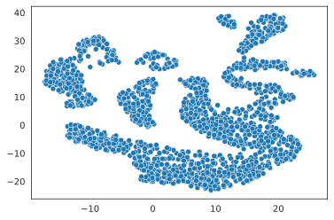

We can also visualize the (skeleton) KNN graph on top of the UMAP. Long
edges indicate that UMAP did not capture this skeleton KNN graph well.
This must be inevitable due to the need to project a complex
N-dimentional structure to 2D, or it might indicate that we are using
some as features some “lateral” genes which are not relevant to the
structure we are investigating. To make this clearer we can just filter
out the short edges:

.. code:: python

    umap_edges = sp.coo_matrix(mc.ut.get_oo_proper(metacells, 'obs_outgoing_weights'))
    min_long_edge_size = 4
    sb.set()
    plot = sb.scatterplot(x=umap_x, y=umap_y)
    for (source_index, target_index, weight) \
            in zip(umap_edges.row, umap_edges.col, umap_edges.data):
        source_x = umap_x[source_index]
        target_x = umap_x[target_index]
        source_y = umap_y[source_index]
        target_y = umap_y[target_index]
        if hypot(target_x - source_x, target_y - source_y) >= min_long_edge_size:
            plt.plot([source_x, target_x], [source_y, target_y],
                     linewidth=weight * 2, color='indigo')
    plt.show()

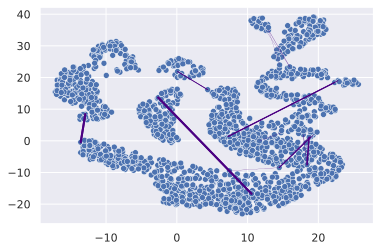

Further analysis
----------------

Metacells is **not** an scRNA analysis method. Rather, it is meant to be
an (early) step in the analysis process. The promise of metacells is
that it makes further analysis easier; instead of grappling with many
individual cells with a very weak and noisy signal of few hundred UMIs
in each, one can analyze fewer complete metacells with a strong signal
of tens of thousands of UMIs, which allows for robust estimation of
their gene expression levels. Therefore, working on metacells instead of
single cells makes life easier for any further analysis method one
wishes to use.

Further analysis methods are expected to create variable-sized groups of
metacells with a similar “cell type” or gradients of metacells between
such “cell types”, based on the gene programs they express. Such methods
are beyond the scope of the metacells package; it merely prepares the
input for such methods and is agnostic to the exact method of further
analysis.

In particular, “metacells of metacells” is *not* a good method: An
“ideal” metacell is defined “a group of cells, with a maximal size, with
the same biological state”. Crucially, this maximal size is picked to be
the smallest that allows for robust estimation of gene expression in the
metacell; this allows for capturing rare behaviors in their own
metacells, instead of them becoming outliers.

Computing “metacells of metacells” would suffer from the same problem as
having a too-large target metacell size: it would artifically quantize
gradients into less intermediate states, and it would identify rare
behavior metacells as outliers. At the same time, computing
metacells-of-metacells can not be trusted to group all the metacells of
the “same” (or very similar) cell state together, since the grouping
will obey some (artificial) maximal size limit.

Thus, the best thing we can do now is to save the data, and feed it to a
separate further data analysis pipeline. To import the data into Seurat,
we first need to delete the special ``__name__`` property, since for
some reason it breaks the Seurat importer.

The `manual analysis vignette <Manual_Analysis.html>`__ demonstrates
manual analysis of the data (based on the
`MCView <https://tanaylab.github.io/MCView>`__ tool), and the `seurat
analysis vignette <Seurat_Analysis.html>`__ demonstrates importing the
metacells into `Seurat <https://satijalab.org/seurat/index.html>`__ for
further analysis there.

.. code:: python

    clean.write('cells.h5ad')
    metacells.write('metacells.h5ad')
    del metacells.uns['__name__']
    metacells.write('for_seurat.h5ad')
