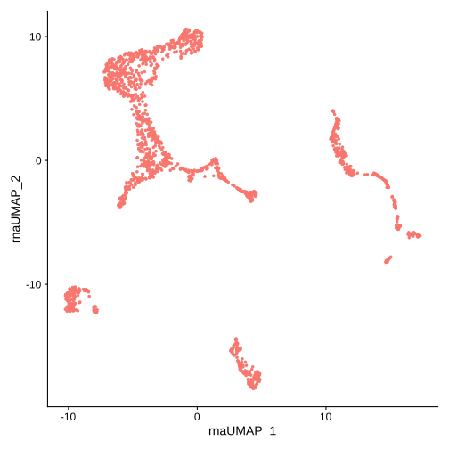

Metacells Seurat Analysis Vignette
==================================

This vignette demonstrates a possible
`Seurat <https://satijalab.org/seurat/index.html>`__ analysis of the
metacells generated from the basic `metacells
vignette <Metacells_Vignette.html>`__. The latest version of this
vignette is available in
`Github <https://github.com/tanaylab/metacells/blob/master/sphinx/Seurat_Analysis.rst>`__.

Preparation
-----------

You should first run the basic metacells vignette to obtain the file
``metacells.h5ad``. Next, we will require the R libraries we will be
using. Note that installation of
`SeuratData <https://github.com/satijalab/seurat-data>`__ and
`SeuratDisk <https://github.com/mojaveazure/seurat-disk>`__ is
non-standard.

.. code:: r

    library(anndata)
    library(dplyr)
    library(Seurat)
    library(SeuratDisk)
    options(jupyter.plot_mimetypes = 'image/svg+xml')

.. code::

    Attaching package: ‘dplyr’

    The following objects are masked from ‘package:stats’:

        filter, lag

    The following objects are masked from ‘package:base’:

        intersect, setdiff, setequal, union

    Attaching SeuratObject

    Registered S3 method overwritten by 'SeuratDisk':
      method            from
      as.sparse.H5Group Seurat

Getting the raw data
--------------------

We will use the data generated by the metacells vignette, the
``metacells.h5ad`` file generated by it. We’ll need to convert it to
Seurat’s format and load it as such. The ``Convert`` function should in
theory do this for us, but it is notoriously flaky and will fail for
different reasons. As life is too short, we manually convert the data
instead (note this will not preserve the ``obsp``, ``varp`` and
unstructured annotations).

.. code:: r

    # This will not work because "reasons":
    #     Convert(source="metacells.h5ad", assay="RNA", dest="h5seurat", overwrite=TRUE, verbose=FALSE)
    #     mdata <- LoadH5Seurat("metacells.h5seurat", verbose=FALSE)
    # So we are forced to do this instead:
    adata <- read_h5ad("metacells.h5ad")
    mdata <- CreateSeuratObject(counts=t(adata$X), meta.data=adata$obs)
    for (property in names(adata$var)) {
       mdata[["RNA"]][[property]] <- adata$var[[property]]
    }
    # You can write this to the disk if you want:
    # SaveH5Seurat(mdata, filename="metacells.h5seurat", overwrite=TRUE, verbose=FALSE)
    mdata

.. code::

    Warning message:
    “Feature names cannot have underscores ('_'), replacing with dashes ('-')”

.. code::

    An object of class Seurat
    22617 features across 1606 samples within 1 assay
    Active assay: RNA (22617 features, 0 variable features)

Analysis
--------

Full analysis of the data using Seurat is outside the scope of this
vignette; see the Seurat
`documentation <https://satijalab.org/seurat/index.html>`__. That said,
we’ll just do some simple PCA analysis based on the Seurat
`tutorial <https://satijalab.org/seurat/articles/weighted_nearest_neighbor_analysis.html>`__.

.. code:: r

    pca <- NormalizeData(mdata) %>% FindVariableFeatures(verbose=FALSE) %>% ScaleData(verbose=FALSE) %>% RunPCA(verbose=FALSE)
    pca <- RunUMAP(pca, reduction = 'pca', dims = 1:30, assay = 'RNA',
                   reduction.name = 'rna.umap', reduction.key = 'rnaUMAP_', verbose=FALSE)
    DimPlot(pca, reduction = 'rna.umap') + NoLegend()

.. code::

    Warning message:
    “The default method for RunUMAP has changed from calling Python UMAP via reticulate to the R-native UWOT using the cosine metric
    To use Python UMAP via reticulate, set umap.method to 'umap-learn' and metric to 'correlation'
    This message will be shown once per session”

