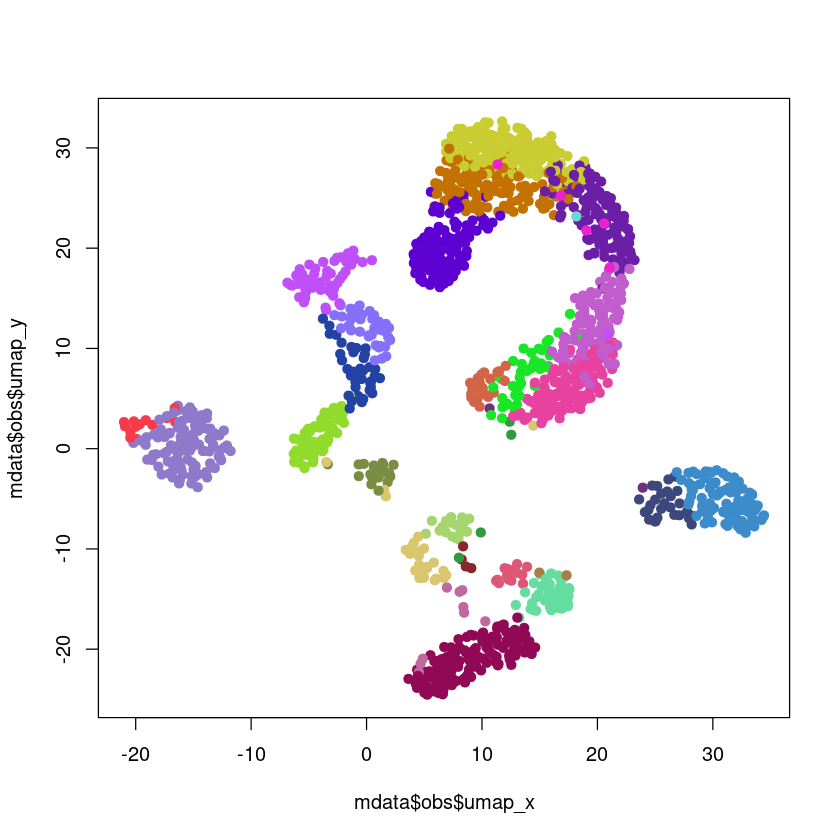

Metacells Manual Analysis Vignette
==================================

This vignette demonstrates a possible manual analysis of the metacells
generated from the basic metacells vignette. The
`metacells_vignette.tgz <http://www.wisdom.weizmann.ac.il/~atanay/metac_data/metacells_vignette.tgz>`__
file contains both the basic vignette jupyter notebook as well as this
one.

Preparation
-----------

You should first run the basic metacells vignette to obtain the file
``metacells.h5ad``. Next, we will require the R libraries we will be
using:

.. code:: r

    require('anndata')
    require('stats')
    source('/home/obk/chameleon/R/chameleon.R')

.. code::

    Loading required package: anndata

Getting the raw data
--------------------

We will use the data generated by the metacells vignette, the
``metacells.h5ad`` file generated by it. We’ll also read the list of
forbidden genes for use below.

.. code:: r

    mdata <- anndata::read_h5ad('metacells.h5ad')
    forbidden_genes <- as.character(t(read.table('forbidden_gene_names.txt')))

Clustering
----------

The 1st step we’ll do is to cluster the metacells. Ideally, we’d have
“similar” cell types in the same cluster and “different” cell behaviors
in different clusters. The specific algorithm doesn’t matter (much) as
these clusters would only be used in guiding us towards understanding
the true structure of the data. The key requirement is that the method
will create clusters which are “homogeneous”, even if at the cost of
creating (a few) different clusters for “very similar” behaviors.

In this example, we perform K-means analysis of the data (looking only
at “interesting” genes), choosing a large enough K. If we choose a
too-low K (see a cluster which is contains “too-different” behaviors)
we’ll need to backtrack and repeat the analysis with a higher K. If we
choose a too-high K we’ll get multiple clusters that are “too-similar”,
which is easy to recover from by assigning the same annotation to
metacells in both clusters. However, we want K to be reasonably smaller
than the number of metacells to help us detect internal structure. We
have chosen K=32 for this example.

We also need to decide on how to compute distances between metacells for
the clustering. Here we chose to only look at “interesting” genes which
are not in the forbidden genes list, and use the log of each such
interesting gene expression (fraction in each cell). Again, other
methods are also possible, as long as we generate reasonable quality
clusters.

.. code:: r

    umis <- as.matrix(mdata$X)
    fractions <- umis / rowSums(umis)
    log_fractions <- log2(1e-5 + fractions)
    genes_max <- apply(log_fractions, 2, max)
    genes_min <- apply(log_fractions, 2, min)
    genes_mask <- (genes_max - genes_min) > 3 & genes_max > -12
    names(genes_mask) <- mdata$var_names
    forbidden_genes <- as.character(t(read.table('forbidden_gene_names.txt')))
    genes_mask[forbidden_genes] <- FALSE
    interesting_log_fractions <- log_fractions[,genes_mask]
    dim(interesting_log_fractions)

.. raw:: html

    
    <ol class=list-inline><li>1542</li><li>1930</li></ol>

This has given us a matrix of 1542 metacells and 1930 genes expression
levels in each one. We can now use this to cluster the metacells into
coarse groups:

.. code:: r

    set.seed(123456)
    k_means <- stats::kmeans(log_fractions, centers=32)
    cluster_of_metacells <- as.integer(k_means$cluster)
    mdata$obs$cluster <- cluster_of_metacells

We now split our 1542 metacells to 32 clusters, which is much more
manageable. Before we actually start analyzing the structure of the
metacells using this clusters, let us give each one a unique color. We
can use the ``chameleon`` package to automatically assign colors to the
clusters in a way that hopefully somewhat reflects the clusters
structure, using the same interesting genes.

.. code:: r

    color_of_clusters <- data_colors(interesting_log_fractions, group=mdata$obs$cluster)

For example, we can use these colors to display the 2D UMAP projection
computed by the basic metacells vignette:

.. code:: r

    color_of_metacells <- color_of_clusters[cluster_of_metacells]
    plot(mdata$obs$umap_x, mdata$obs$umap_y, col=color_of_metacells, pch=19)

This shows us a pretty nice locality of the clusters in the 2D UMAP
projection, which makes them a good start for the manual analysis. It
does not, however, mean that we have exactly 32 distinct behaviors in
the data (from actual manual analysis of the data, the number of more
like 23). That is, and as is suggested by the projection, in some cases
a few clusters cover what we may consider to be a single behavior
(possibly artificially quantizing a smooth gradient into distinct
steps).

Analysis
--------

The actual analysis is best done using an interactive tool allowing for
flexible investigation of the structure of the data, starting with the
above computed clusters. An example of such a manual tool is **TODO:
MCView**, which can easily import the ``metacells.h5ad`` and the
``cluster-colors.csv`` files and perform this analysis.

.. code:: r

    mdata$write_h5ad('metacells.h5ad')
    write.csv(list(cluster=1:length(color_of_clusters), color=color_of_clusters),
              row.names=FALSE, file='cluster-colors.csv')

.. code::

    None

