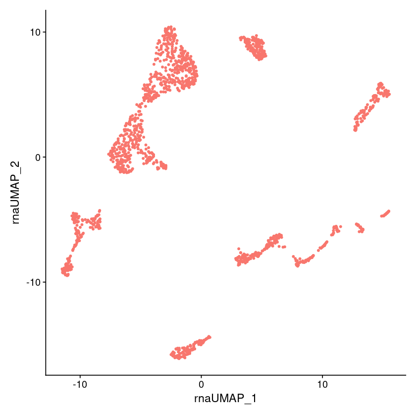

Metacells Seurat Analysis Vignette
==================================

This vignette demonstrates a possible Seurat analysis of the metacells
generated from the basic metacells vignette. The
`metacells_vignette.tgz <http://www.wisdom.weizmann.ac.il/~atanay/metac_data/metacells_vignette.tgz>`__
file contains both the basic vignette jupyter notebook as well as this
one.

Preparation
-----------

You should first run the basic metacells vignette to obtain the file
``metacells.h5ad``. Next, we will require the R libraries we will be
using. Note that installation of
`SeuratData <https://github.com/satijalab/seurat-data>`__ and
`SeuratDisk <https://github.com/mojaveazure/seurat-disk>`__ is
non-standard.

.. code:: r

    library(dplyr)
    library('Seurat')
    library('SeuratData')
    library('SeuratDisk')

.. code::

    Attaching package: ‘dplyr’

    The following objects are masked from ‘package:stats’:

        filter, lag

    The following objects are masked from ‘package:base’:

        intersect, setdiff, setequal, union

    Attaching SeuratObject

    Registered S3 method overwritten by 'cli':
      method     from
      print.boxx spatstat.geom

    Warning message in if (is.na(desc)) {:
    “the condition has length > 1 and only the first element will be used”
    Warning message in if (is.na(desc)) {:
    “the condition has length > 1 and only the first element will be used”
    Warning message in if (is.na(desc)) {:
    “the condition has length > 1 and only the first element will be used”
    Warning message in if (is.na(desc)) {:
    “the condition has length > 1 and only the first element will be used”
    Warning message in if (is.na(desc)) {:
    “the condition has length > 1 and only the first element will be used”
    Warning message in if (is.na(desc)) {:
    “the condition has length > 1 and only the first element will be used”
    Warning message in if (is.na(desc)) {:
    “the condition has length > 1 and only the first element will be used”
    Warning message in if (is.na(desc)) {:
    “the condition has length > 1 and only the first element will be used”
    Warning message in if (is.na(desc)) {:
    “the condition has length > 1 and only the first element will be used”
    Warning message in if (is.na(desc)) {:
    “the condition has length > 1 and only the first element will be used”
    Warning message in if (is.na(desc)) {:
    “the condition has length > 1 and only the first element will be used”
    Warning message in if (is.na(desc)) {:
    “the condition has length > 1 and only the first element will be used”
    Registered S3 method overwritten by 'SeuratDisk':
      method            from
      as.sparse.H5Group Seurat

Getting the raw data
--------------------

We will use the data generated by the metacells vignette, the
``metacells.h5ad`` file generated by it. We’ll need to convert it to
Seurat’s format and load it as such. For some reason, the Seurat
importer chokes on the ``__name__`` property so until this
`bug <https://github.com/mojaveazure/seurat-disk/issues/82>`__ is fixed,
we’ll convert the ``for_seurat.h5ad`` file we created just for this
purpose, without this property:

.. code:: r

    Convert(source="for_seurat.h5ad", assay="RNA", dest="h5seurat", overwrite=TRUE, verbose=FALSE)
    mdata <- LoadH5Seurat("for_seurat.h5seurat", verbose=FALSE)
    mdata

.. code::

    Warning message:
    “Unknown file type: h5ad”
    Creating h5Seurat file for version 3.1.5.9900

    Validating h5Seurat file

    Warning message:
    “Feature names cannot have underscores ('_'), replacing with dashes ('-')”
    Warning message:
    “Feature names cannot have underscores ('_'), replacing with dashes ('-')”

.. code::

    An object of class Seurat
    22617 features across 1542 samples within 1 assay
    Active assay: RNA (22617 features, 0 variable features)

Analysis
--------

Full analysis of the data using Seurat is outside the scope of this
vignette; see the Seurat
`documentation <https://satijalab.org/seurat/index.html>`__. That said,
we’ll just do some simple PCA analysis based on the Seurat
`tutorial <https://satijalab.org/seurat/articles/weighted_nearest_neighbor_analysis.html>`__.

.. code:: r

    pca <- NormalizeData(mdata) %>% FindVariableFeatures(verbose=FALSE) %>% ScaleData(verbose=FALSE) %>% RunPCA(verbose=FALSE)
    pca <- RunUMAP(pca, reduction = 'pca', dims = 1:30, assay = 'RNA',
                   reduction.name = 'rna.umap', reduction.key = 'rnaUMAP_', verbose=FALSE)
    DimPlot(pca, reduction = 'rna.umap', label = FALSE, repel = TRUE, label.size = 2.5) + NoLegend()

.. code::

    Warning message:
    “The default method for RunUMAP has changed from calling Python UMAP via reticulate to the R-native UWOT using the cosine metric
    To use Python UMAP via reticulate, set umap.method to 'umap-learn' and metric to 'correlation'
    This message will be shown once per session”

