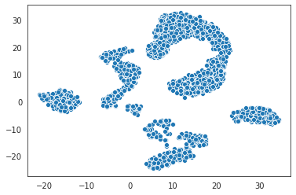

Metacells Vignette
==================

This vignette demonstrates step-by-step use of the metacells package to
analyze scRNA-seq data. It is expected that these steps will be modified
when analyzing other data sets, and points where such modifications are
likely will be called out.

You can download a working version of this vignette from
`metacells_vignette.tgz <http://www.wisdom.weizmann.ac.il/~atanay/metac_data/metacells_vignette.tgz>`__.
This will include all the Jupyter notebook files and the two associated
text files which are loaded in the code below.

Preparation
-----------

First, let’s import the Python packages we’ll be using. If you don’t
have these installed, run ``pip install metacells``, and also
``pip install seaborn`` for the embedded diagrams - this is just for the
purpose of this vignette; the metacells package itself has no dependency
on any visualization packages.

.. code:: ipython3

    import anndata as ad
    import matplotlib.pyplot as plt
    import metacells as mc
    import numpy as np
    import os
    import pandas as pd
    import scipy.sparse as sp
    import seaborn as sb

    from math import hypot
    from matplotlib.collections import LineCollection

    sb.set_style("white")

Getting the raw data
--------------------

The metacells package is built around the
`scanpy <https://pypi.org/project/scanpy/>`__ framework. In particular
it uses `anndata <https://pypi.org/project/anndata/>`__ to hold the
analyzed data, and uses ``.h5ad`` files to persist this data on disk.
You can access also these files directly from R using several packages,
most notably
`anndata <https://cran.r-project.org/web/packages/anndata/index.html>`__.

You can convert data from various “standard” scRNA data formats into a
``.h5ad`` file using any of the functions available in the scanpy and/or
anndata packages. Note that converting textual data to this format takes
a “non-trivial” amount of time for large data sets. Mercifully, this is
a one-time operation. Less excusable is the fact that none of the above
packages memory-map the ``.h5ad`` files so reading large files will
still take a noticeable amount of time for no good reason.

For the purposes of this vignette, we’ll use a 160K cells data set which
is a unification of several batches of PBMC scRNA data from
`10x <https://support.10xgenomics.com/single-cell-gene-expression/datasets%3E>`__,
specifically from the “Single Cell 3’ Paper: Zheng et al. 2017”
datasets. Since 10x do not provide stable links to their data sets, and
to avoid the long time it would take to convert their textual format
files to ``.h5ad`` files, simply download the compressed data file
`pbmc163k.h5ad.gz <http://www.wisdom.weizmann.ac.il/~atanay/metac_data/pbmc163k.h5ad.gz>`__
to your work directory (using ``wget``, ``curl``, your browser’s
download function, etc.), and then run ``gunzip pbmc163k.h5ad.gz`` (or
your zip program of choice) to extract the ``pbmc163k.h5ad`` file which
we read below.

The metacells package uses a convention where the ``__name__``
unstructured property of the data contains its name for logging
purposes; we initialize this name to ``PBMC`` below.

.. code:: ipython3

    raw = ad.read_h5ad('pbmc163k.h5ad')
    mc.ut.set_name(raw, 'PBMC')
    print(raw.shape)

.. code::

    (163234, 32738)

Cleaning the data
-----------------

The first step in processing the data is to extract a “clean” subset of
it for further analysis.

If the data set contains metadata that can be used to rule out some of
the genes or cells, this is a good time to do it, using the
``mc.ut.slice`` function.

Regardless of such metadata, we still need to perform initial filtering
of the data. The exact details might vary depending on your specific
data set’s origins. Still, the metacells package supports a basic
2-phase procedure which should be useful in many cases.

Cleaning the genes
~~~~~~~~~~~~~~~~~~

The first phase excludes genes from the “clean” data.

Excluding genes by name
^^^^^^^^^^^^^^^^^^^^^^^

Some genes are known to be detrimental for the analysis and should be
excluded from the clean data based on their name. The poster child for
such genes are mitochondrial genes. We typically create a list of such
genes in an ``excluded_gene_names.txt`` file, one gene name per line,
and load it from there. There should have been such a file included in
the archive containing this notebook.

**TODO:** How to create an initial list of excluded gene names, and how
to refine it during the iterative analysis process.

.. code:: ipython3

    excluded_gene_names = open('excluded_gene_names.txt').read().split('\n')[:-1]
    print(sorted(excluded_gene_names))

.. code::

    ['IGHMBP2', 'IGLL1', 'IGLL5', 'IGLON5', 'MT-ATP6', 'MT-ATP8', 'MT-CO1', 'MT-CO2', 'MT-CO3', 'MT-CYB', 'MT-ND1', 'MT-ND2', 'MT-ND3', 'MT-ND4', 'MT-ND4L', 'MT-ND5', 'MT-ND6', 'NEAT1', 'TMSB10', 'TMSB4X']

Excluding genes by their expression
^^^^^^^^^^^^^^^^^^^^^^^^^^^^^^^^^^^

We also want to exclude genes based on their expression. For example, it
makes no sense to keep genes which have zero expression in our data set
- in general we allow specifying a threshold on the minimal total UMIs
of the gene in the data set. In addition, we have discovered it is
useful to exclude “noisy lonely genes”, that is, genes which have a
significant expression level but no significant correlation with any
other gene.

Automating clean genes selection
^^^^^^^^^^^^^^^^^^^^^^^^^^^^^^^^

We provide a function that automates the above (given an explicit list
of excluded gene names). All it does is create per-gene (variable)
annotations in the data: ``excluded_gene``, ``properly_sampled_gene``,
and ``noisy_lonely_gene``. You can achieve the same effect by manually
invoking the lower-level functions (e.g.,
``mc.tl.find_noisy_lonely_genes``). Or, you could create additional
masks of your own based on your own criteria.

.. code:: ipython3

    mc.pl.analyze_clean_genes(raw,
                              excluded_gene_names=excluded_gene_names,
                              random_seed=123456)

.. code::

    set PBMC.var[properly_sampled_gene]: 22637 true (69.15%) out of 32738 bools
    set PBMC.var[excluded_gene]: 20 true (0.06109%) out of 32738 bools
    /home/obk/.local/lib/python3.7/site-packages/anndata/_core/anndata.py:1094: FutureWarning: is_categorical is deprecated and will be removed in a future version.  Use is_categorical_dtype instead
      if not is_categorical(df_full[k]):
    /home/obk/.local/lib/python3.7/site-packages/pandas/core/arrays/categorical.py:2487: FutureWarning: The `inplace` parameter in pandas.Categorical.remove_unused_categories is deprecated and will be removed in a future version.
      res = method(*args, **kwargs)
    set PBMC.var[noisy_lonely_gene]: 0 true (0%) out of 32738 bools

We then combine all these mask into a final ``clean_gene`` mask. By
default this is based on the three masks listed above, but you can
customize it to use any list of per-gene masks instead.

.. code:: ipython3

    mc.pl.pick_clean_genes(raw)

.. code::

    set PBMC.var[clean_gene]: 22617 true (69.08%) out of 32738 bools

This is a good time to save the data so we can load it later without
recomputing it. We’ll do this under a different name to avoid modifying
the raw file, and we’ll rename our variable refering to it for clarity.

.. code:: ipython3

    raw.write('full.h5ad')
    full = raw

.. code::

    /home/obk/.local/lib/python3.7/site-packages/anndata/_core/anndata.py:1192: FutureWarning: is_categorical is deprecated and will be removed in a future version.  Use is_categorical_dtype instead
      if is_string_dtype(df[key]) and not is_categorical(df[key])

Cleaning the cells
~~~~~~~~~~~~~~~~~~

The second phase is excluding cells. We do so based on two criteria: the
total number of UMIs we have for each cell, and the fraction of these
UMIs that come from excluded (non-clean) genes.

Setting these thresholds is done manually. To guide this decision, we
can visualize the relevant distributions.

Thresholds on the total number of UMIs
^^^^^^^^^^^^^^^^^^^^^^^^^^^^^^^^^^^^^^

We’ll start with looking at the total UMIs per cell. We set a threshold
for the minimal and maximal number of UMIs of cells we wish to analyze.

.. code:: ipython3

    properly_sampled_min_cell_total = 800
    properly_sampled_max_cell_total = 8000

    total_umis_of_cells = mc.ut.get_o_numpy(full, name='__x__', sum=True)

    plot = sb.distplot(total_umis_of_cells)
    plot.set(xlabel='UMIs', ylabel='Density', yticks=[])
    plot.axvline(x=properly_sampled_min_cell_total, color='darkgreen')
    plot.axvline(x=properly_sampled_max_cell_total, color='crimson')

    too_small_cells_count = sum(total_umis_of_cells < properly_sampled_min_cell_total)
    too_large_cells_count = sum(total_umis_of_cells > properly_sampled_max_cell_total)

    too_small_cells_percent = 100.0 * too_small_cells_count / len(total_umis_of_cells)
    too_large_cells_percent = 100.0 * too_large_cells_count / len(total_umis_of_cells)

    print(f"Will exclude %s (%.2f%%) cells with less than %s UMIs"
          % (too_small_cells_count,
             too_small_cells_percent,
             properly_sampled_min_cell_total))
    print(f"Will exclude %s (%.2f%%) cells with more than %s UMIs"
          % (too_large_cells_count,
             too_large_cells_percent,
             properly_sampled_max_cell_total))

.. code::

    Will exclude 12983 (7.95%) cells with less than 800 UMIs
    Will exclude 349 (0.21%) cells with more than 8000 UMIs

.. image:: output_18_1.png

Thresholds on the fractionof excluded gene UMIs
^^^^^^^^^^^^^^^^^^^^^^^^^^^^^^^^^^^^^^^^^^^^^^^

We also set a threshold on the fraction of excluded gene UMIs in each
cell we wish to analyze. This ensures that there will be a sufficient
number of clean gene UMIs left to analyze.

.. code:: ipython3

    properly_sampled_max_excluded_genes_fraction = 0.1

    excluded_genes_data = mc.tl.filter_data(full, var_masks=['~clean_gene'])[0]
    excluded_umis_of_cells = mc.ut.get_o_numpy(excluded_genes_data, name='__x__', sum=True)
    excluded_fraction_of_umis_of_cells = excluded_umis_of_cells / total_umis_of_cells

    plot = sb.distplot(excluded_fraction_of_umis_of_cells)
    plot.set(xlabel='Fraction of excluded gene UMIs', ylabel='Density', yticks=[])
    plot.axvline(x=properly_sampled_max_excluded_genes_fraction, color='crimson')

    too_excluded_cells_count = sum(excluded_fraction_of_umis_of_cells > properly_sampled_max_excluded_genes_fraction)

    too_excluded_cells_percent = 100.0 * too_excluded_cells_count / len(total_umis_of_cells)

    print(f"Will exclude %s (%.2f%%) cells with more than %.2f%% excluded gene UMIs"
          % (too_excluded_cells_count,
             too_excluded_cells_percent,
             100.0 * properly_sampled_max_excluded_genes_fraction))

.. code::

    /home/obk/.local/lib/python3.7/site-packages/anndata/_core/anndata.py:1094: FutureWarning: is_categorical is deprecated and will be removed in a future version.  Use is_categorical_dtype instead
      if not is_categorical(df_full[k]):
    /home/obk/.local/lib/python3.7/site-packages/pandas/core/arrays/categorical.py:2487: FutureWarning: The `inplace` parameter in pandas.Categorical.remove_unused_categories is deprecated and will be removed in a future version.
      res = method(*args, **kwargs)

.. code::

    Will exclude 256 (0.16%) cells with more than 10.00% excluded gene UMIs

.. image:: output_20_2.png

Automating clean cells selection
^^^^^^^^^^^^^^^^^^^^^^^^^^^^^^^^

We provide a function that automates the above (given the thresholds).
All it does is create per-cell (observation) annotation in the data:
``properly_sampled_cell``. You can achieve the same effect by manually
invoking the lower-level functions (e.g.,
``mc.tl.find_properly_sampled_cells``). Or, you could create additional
masks of your own based on your own criteria.

.. code:: ipython3

    mc.pl.analyze_clean_cells(
        full,
        properly_sampled_min_cell_total=properly_sampled_min_cell_total,
        properly_sampled_max_cell_total=properly_sampled_max_cell_total,
        properly_sampled_max_excluded_genes_fraction=properly_sampled_max_excluded_genes_fraction)

.. code::

    /home/obk/.local/lib/python3.7/site-packages/anndata/_core/anndata.py:1094: FutureWarning: is_categorical is deprecated and will be removed in a future version.  Use is_categorical_dtype instead
      if not is_categorical(df_full[k]):
    /home/obk/.local/lib/python3.7/site-packages/pandas/core/arrays/categorical.py:2487: FutureWarning: The `inplace` parameter in pandas.Categorical.remove_unused_categories is deprecated and will be removed in a future version.
      res = method(*args, **kwargs)
    set PBMC.obs[properly_sampled_cell]: 149825 true (91.79%) out of 163234 bools

We again combine all the relevant masks into a final ``clean_cell``
mask. By default this is based just on the ``properly_sampled_cell``
mask, but you can customize it to use any list of per-cell masks
instead.

.. code:: ipython3

    mc.pl.pick_clean_cells(full)

.. code::

    set PBMC.obs[clean_cell]: 149825 true (91.79%) out of 163234 bools

Extracting the clean data
~~~~~~~~~~~~~~~~~~~~~~~~~

We now extract just the clean genes and cells data out of the data set,
using the ``clean_gene`` and ``clean_cell`` masks, to obtain the clean
data we’ll be analyzing.

.. code:: ipython3

    clean = mc.pl.extract_clean_data(full)

.. code::

    set PBMC.clean.obs[full_cell_index]: 149825 int64s
    set PBMC.clean.var[full_gene_index]: 22617 int64s

Computing the metacells
-----------------------

Once we have a clean data set for analysis, we can go ahead and compute
the metacells.

Main parameters
~~~~~~~~~~~~~~~

There are many parameters we can tweak (see
``mc.pl.divide_and_conquer_pipeline``). Here we’ll just discuss
controlling the main ones.

Forbidden genes
^^^^^^^^^^^^^^^

The ``forbidden_gene_names`` forbids genes from being used as feature
genes. Such genes are still used to detect outliers; that is, while each
metacell is still expected to contain cells with the “same level of
expression” of these genes, we will not try to create metacells which
are distinct from the rest of the population by this expression level.

This is used to prevent “lateral” or “irrelevant” genes to influence the
metacell creation; the poster child for such genes is cell cycle
(ribosomal) genes, as we are trying to create metacells with the same
“cell type” rather than the same “cell cycle state”.

We typically create a list of such genes in a
``forbidden_gene_names.txt`` file, one gene name per line, and load it
from there. There should have been such a file included in the archive
containing this notebook.

**TODO**: How to create an initial list of forbidden gene names, and how
to refine it during the iterative analysis process.

.. code:: ipython3

    forbidden_gene_names = open('forbidden_gene_names.txt').read().split('\n')[:-1]
    print(len(forbidden_gene_names))

.. code::

    4037

Reproducibility
^^^^^^^^^^^^^^^

The ``random_seed`` must be non-zero to ensure reprodibility. Note that
even though the implementation is parallel for efficiency, the results
are still reprodicible given the same random seed (in contrast to the
``umap`` package).

Target Metacell size
^^^^^^^^^^^^^^^^^^^^

The ``target_metacell_size`` (number of UMIs). We want each metacell to
have a sufficient number of UMIs so that we get a robust estimation of
the expression of each (relevant) gene in it. By default the target is
160,000 UMIs. The algorithm will generate metacells no larger than
double this size (that is, a maximum of 320,000 UMIs per metacell) and
no fewer than a quarter of this size (that is, a minimum of 40,000 UMIs
per metacell), where metacells smaller than half the size (that is,
between 40,000 UMIs and 80,000 UMIs) are “especially distinct”. These
ratios and relevant thresholds can all be controlled using additional
parameters.

Grouping into Metacells
~~~~~~~~~~~~~~~~~~~~~~~

We can finally compute the metacells. We are only running this on ~160K
cells, still this may take a few minutes, depending on the number of
cores on your server. For ~2 million cells this takes ~10 minutes on a
28-core server.

.. code:: ipython3

    mc.pl.divide_and_conquer_pipeline(clean,
                                      forbidden_gene_names=forbidden_gene_names,
                                      #target_metacell_size=...,
                                      random_seed=123456)

.. code::

    set PBMC.clean.var[rare_gene_module_0]: 4 true (0.01769%) out of 22617 bools
    set PBMC.clean.var[rare_gene_module_1]: 29 true (0.1282%) out of 22617 bools
    set PBMC.clean.var[rare_gene]: 33 true (0.1459%) out of 22617 bools
    set PBMC.clean.obs[cells_rare_gene_module]: 149085 outliers (99.51%) out of 149825 int32 elements with 2 groups with mean size 370
    set PBMC.clean.obs[rare_cell]: 740 true (0.4939%) out of 149825 bools
    /home/obk/.local/lib/python3.7/site-packages/anndata/_core/anndata.py:1094: FutureWarning: is_categorical is deprecated and will be removed in a future version.  Use is_categorical_dtype instead
      if not is_categorical(df_full[k]):
    /home/obk/.local/lib/python3.7/site-packages/pandas/core/arrays/categorical.py:2487: FutureWarning: The `inplace` parameter in pandas.Categorical.remove_unused_categories is deprecated and will be removed in a future version.
      res = method(*args, **kwargs)
    set PBMC.clean.uns[pre_directs]: 16
    set PBMC.clean.uns[directs]: 24
    set PBMC.clean.var[pre_high_total_gene]: 8315 positive (36.76%) out of 22617 int32s
    set PBMC.clean.var[high_total_gene]: 10398 positive (45.97%) out of 22617 int32s
    set PBMC.clean.var[pre_high_relative_variance_gene]: 11682 positive (51.65%) out of 22617 int32s
    set PBMC.clean.var[high_relative_variance_gene]: 13256 positive (58.61%) out of 22617 int32s
    set PBMC.clean.var[forbidden_gene]: 4037 true (17.85%) out of 22617 bools
    set PBMC.clean.var[pre_feature_gene]: 427 positive (1.888%) out of 22617 int32s
    set PBMC.clean.var[feature_gene]: 622 positive (2.75%) out of 22617 int32s
    set PBMC.clean.var[pre_gene_deviant_votes]: 2403 positive (10.62%) out of 22617 int32s
    set PBMC.clean.var[gene_deviant_votes]: 2359 positive (10.43%) out of 22617 int32s
    set PBMC.clean.obs[pre_cell_directs]: 149825 int32s with mean 1.038
    set PBMC.clean.obs[cell_directs]: 149825 int32s with mean 1.031
    set PBMC.clean.obs[pre_pile]: 0 outliers (0%) out of 149825 int32 elements with 18 groups with mean size 8324
    set PBMC.clean.obs[pile]: 0 outliers (0%) out of 149825 int32 elements with 24 groups with mean size 6243
    set PBMC.clean.obs[pre_candidate]: 0 outliers (0%) out of 149825 int32 elements with 1728 groups with mean size 86.7
    set PBMC.clean.obs[candidate]: 0 outliers (0%) out of 149825 int32 elements with 1569 groups with mean size 95.49
    set PBMC.clean.obs[pre_cell_deviant_votes]: 0 positive (0%) out of 149825 int32s
    set PBMC.clean.obs[cell_deviant_votes]: 764 positive (0.5099%) out of 149825 int32s
    set PBMC.clean.obs[pre_dissolved]: 0 true (0%) out of 149825 bools
    set PBMC.clean.obs[dissolved]: 150 true (0.1001%) out of 149825 bools
    set PBMC.clean.obs[pre_metacell]: 0 outliers (0%) out of 149825 int32 elements with 1702 groups with mean size 88.03
    set PBMC.clean.obs[metacell]: 914 outliers (0.61%) out of 149825 int32 elements with 1542 groups with mean size 96.57
    set PBMC.clean.obs[outlier]: 914 true (0.61%) out of 149825 bools

This has written many annotations for each cell (observation), the most
important of which is ``metacell`` specifying the 0-based index of the
metacell each cell belongs to (or -1 if the cell is an “outlier”).

However, for further analysis, what we want is data where each
observation is a metacell:

.. code:: ipython3

    metacells = mc.pl.collect_metacells(clean, name='PBMC.metacells')

.. code::

    set PBMC.metacells.var[excluded_gene]: 0 true (0%) out of 22617 bools
    set PBMC.metacells.var[clean_gene]: 22617 true (100%) out of 22617 bools
    set PBMC.metacells.var[forbidden_gene]: 4037 true (17.85%) out of 22617 bools
    set PBMC.metacells.var[pre_feature_gene]: 427 positive (1.888%) out of 22617 int32s
    set PBMC.metacells.var[feature_gene]: 622 positive (2.75%) out of 22617 int32s
    set PBMC.metacells.obs[pile]: 1542 int32s
    set PBMC.metacells.obs[candidate]: 1542 int32s

Visualizing the Metacells
~~~~~~~~~~~~~~~~~~~~~~~~~

A common technique is to use UMAP to project the metacells to a 2D
scatter plot. The code provides built-in support for generating such
projections. UMAP offers many parameters that can be tweaked, but the
main one we offer control over is ``min_dist`` which controls how
tightly the points are packed together. A non-zero ``random_seed`` will
make this computation reproducible, at the cost of switching to a
single-threaded implementation.

.. code:: ipython3

    mc.pl.compute_umap_by_features(metacells, min_dist=2.0, random_seed=123456)

.. code::

    set PBMC.metacells.var[top_feature_gene]: 622 true (2.75%) out of 22617 bools
    set PBMC.metacells.obsp[obs_balanced_ranks]: 14049 nonzero (0.5908%) out of 2377764 elements
    set PBMC.metacells.obsp[obs_pruned_ranks]: 5326 nonzero (0.224%) out of 2377764 elements
    set PBMC.metacells.obsp[obs_outgoing_weights]: 5326 nonzero (0.224%) out of 2377764 elements
    /home/obk/.local/lib/python3.7/site-packages/umap/umap_.py:1330: RuntimeWarning: divide by zero encountered in power
      return 1.0 / (1.0 + a * x ** (2 * b))
    /home/obk/.local/lib/python3.7/site-packages/umap/umap_.py:1736: UserWarning: using precomputed metric; transform will be unavailable for new data and inverse_transform will be unavailable for all data
      "using precomputed metric; transform will be unavailable for new data and inverse_transform "
    set PBMC.metacells.obs[umap_x]: 1542 float32s
    set PBMC.metacells.obs[umap_y]: 1542 float32s

This filled in ``umap_x`` and ``umap_y`` per-metacell (observation)
annotations, which can be used to generate 2D projection diagrams (it
also filled in a boolean ``top_feature_gene`` mask designating the genes
used). Typically such diagrams use additional metadata (such as type
annotations) to color the points, but here we just show the raw
projection:

.. code:: ipython3

    umap_x = mc.ut.get_o_numpy(metacells, 'umap_x')
    umap_y = mc.ut.get_o_numpy(metacells, 'umap_y')
    plot = sb.scatterplot(x=umap_x, y=umap_y)

We can also visualize the (skeleton) KNN graph on top of the UMAP. Long
edges indicate that UMAP did not capture this skeleton KNN graph well.
This must be inevitable due to the need to project a complex
N-dimentional structure to 2D, or it might indicate that we are using
some as features some “lateral” genes which are not relevant to the
structure we are investigating. To make this clearer we can just filter
out the short edges:

.. code:: ipython3

    umap_edges = sp.coo_matrix(mc.ut.get_oo_proper(metacells, 'obs_outgoing_weights'))
    sb.set()
    plot = sb.scatterplot(x=umap_x, y=umap_y)
    for (source_index, target_index, weight) \
            in zip(umap_edges.row, umap_edges.col, umap_edges.data):
        source_x = umap_x[source_index]
        target_x = umap_x[target_index]
        source_y = umap_y[source_index]
        target_y = umap_y[target_index]
        if hypot(target_x - source_x, target_y - source_y) > 4:
            plt.plot([source_x, target_x], [source_y, target_y],
                     linewidth=weight * 2, color='indigo')
    plt.show()

.. image:: output_41_0.png

Further analysis
----------------

Metacells is **not** an scRNA analysis method. Rather, it is meant to be
an (early) step in the analysis process. The promise of metacells is
that it makes further analysis easier; instead of grappling with many
individual cells with a very weak and noisy signal of few hundred UMIs
in each, one can analyze fewer complete metacells with a strong signal
of tens of thousands of UMIs, which allows for robust estimation of
their gene expression levels. Therefore, working on metacells instead of
single cells makes life easier for any further analysis method one
wishes to use.

Further analysis methods are expected to create variable-sized groups of
metacells with a similar “cell type” or gradients of metacells between
such “cell types”, based on the gene programs they express. Such methods
are beyond the scope of the metacells package; it merely prepares the
input for such methods and is agnostic to the exact method of further
analysis.

In particular, “metacells of metacells” is *not* a good method: An
“ideal” metacell is defined “a group of cells, with a maximal size, with
the same biological state”. Crucially, this maximal size is picked to be
the smallest that allows for robust estimation of gene expression in the
metacell; this allows for capturing rare behaviors in their own
metacells, instead of them becoming outliers.

Computing “metacells of metacells” would suffer from the same problem as
having a too-large target metacell size: it would artifically quantize
gradients into less intermediate states, and it would identify rare
behavior metacells as outliers. At the same time, computing
metacells-of-metacells can not be trusted to group all the metacells of
the “same” (or very similar) cell state together, since the grouping
will obey some (artificial) maximal size limit.

Thus, the best thing we can do now is to save the data, and feed it to a
separate further data analysis pipeline. To import the data into Seurat,
we first need to delete the special ``__name__`` property, since for
some reason it breaks the Seurat importer.

.. code:: ipython3

    clean.write('cells.h5ad')
    metacells.write('metacells.h5ad')
    del metacells.uns['__name__']
    metacells.write('for_seurat.h5ad')

.. code::

    /home/obk/.local/lib/python3.7/site-packages/anndata/_core/anndata.py:1192: FutureWarning: is_categorical is deprecated and will be removed in a future version.  Use is_categorical_dtype instead
      if is_string_dtype(df[key]) and not is_categorical(df[key])

